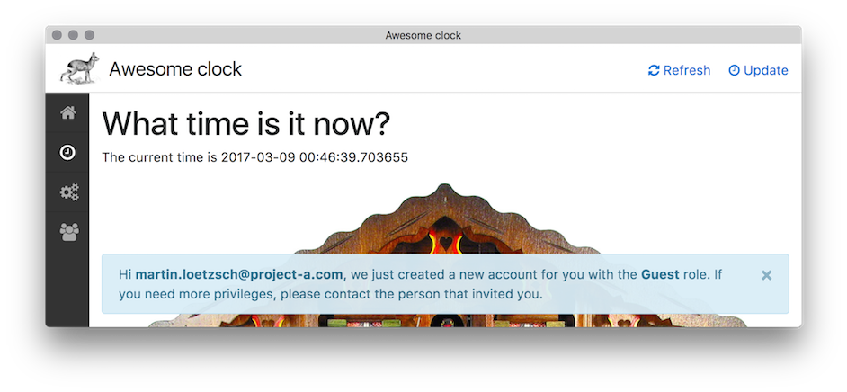

# Mara ACL

Default ACL implementation for mara with the following design choices:

- Authentication of users is handled externally, e.g. through a [Oauth2 Proxy](https://github.com/oauth2-proxy/oauth2-proxy). 
  An upstream authentication app manages authentication and then adds a http header identifying the user to each authenticated request.
- Each user is assigned a single role.
- Permissions are not based on urls, but on application-defined "resources". 
  Thus, checking of permissions needs to be done in the application.

The ACL provides a single UI for both user and permission management. 
Users can be added / removed and their roles can be changed like this:

New roles are created by moving a user to a new role.

Permissions can be set for 

- an individual user or a whole role,
- an individual resource, a group of resources or "All" resources.

Individual users inherit permissions from their role, and permissions on higher levels overwrite permissions on lower levels:

Each new user that is authenticated is automatically created 
with a default role in the acl:

This behavior can be switched off (so that only invited users can join). See [config.py](mara_acl/config.py) for details. 

Please have a look at the mara example application for how to integrate this ACL implementation.
